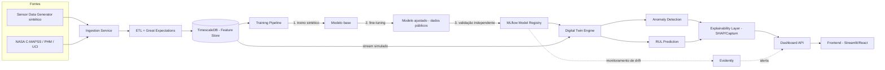

# AeroQuant Lab — Fase 1: Auditoria Crítica e Arquitetura

## 1. Auditoria Crítica do Projeto

### 1.1 O que está bem colocado
O master prompt define corretamente uma separação entre **camada científica** (pergunta de pesquisa, validação, publicação) e **camada de engenharia** (arquitetura, pipelines, MLOps). Isso é raro em projetos de PHM (Prognostics and Health Management) feitos fora de laboratórios formais, e é a decisão certa: sem isso, o projeto vira "mais um repositório de ML" em vez de pesquisa reprodutível.

A estratégia de dados em 3 níveis (sintético → público → híbrido) também é metodologicamente sólida — é essencialmente **domain randomization + transfer learning**, técnica estabelecida em robótica e PHM para lidar com escassez de dados reais de falha (falhas de aeronave são, felizmente, raras — o que é ótimo para segurança e péssimo para tamanho de dataset).

### 1.2 Riscos de escopo (o mais crítico)
13 fases cobrindo Digital Twin + 5 famílias de modelos ML + Computer Vision + Monte Carlo + XAI + MLOps completo + artigo científico é, honestamente, **escopo de tese de doutorado de 3-4 anos com equipe**, não de um projeto solo. Isso não é motivo para reduzir ambição, mas para ser explícito sobre uma decisão que você vai precisar tomar cedo:

- **Opção A — Profundidade**: escolher 1-2 fases (ex.: RUL + Digital Twin) e levá-las a nível de publicação (benchmark contra literatura, validação estatística rigorosa, ablação completa).
- **Opção B — Amplitude**: implementar as 13 fases em nível MVP funcional, sem rigor de publicação em cada uma.

Essas duas opções levam a arquiteturas ligeiramente diferentes (Opção A pede mais infraestrutura de experimentação; Opção B pede mais foco em integração). Meu recomendo: **Opção A com RUL + Digital Twin como núcleo científico**, e as demais fases (CV, dashboard, simulação) como módulos de suporte/produto ao redor desse núcleo — isso dá um caminho de publicação real (RUL com transfer learning sintético→C-MAPSS é uma contribuição defensável) sem abandonar a visão de plataforma completa.

### 1.3 Riscos científicos
- **Gap sintético-real**: modelos estocásticos de degradação não capturam a física real de falha de turbinas/componentes. Isso precisa ser tratado como *limitação central* do estudo, não escondido — é inclusive um ângulo de contribuição científica (quantificar o gap e o quanto fine-tuning o reduz).
- **Vazamento temporal**: em RUL, qualquer validação cruzada aleatória (k-fold padrão) vaza informação futura para o passado. É obrigatório usar validação por unidade/motor (como no C-MAPSS, que já separa por `unit_id`) ou walk-forward temporal.
- **Visão computacional sem dados reais**: não existem datasets públicos relevantes e licenciados de inspeção visual de aeronaves em escala. Isso provavelmente também precisará ser sintético (renderização 3D ou augmentation agressivo), o que enfraquece a alegação científica dessa fase especificamente — vale sinalizar isso como limitação desde já.
- **Explicabilidade em modelos sequenciais**: SHAP em LSTM/Transformer é caro computacionalmente (KernelSHAP escala mal); a escolha do método (DeepSHAP, Integrated Gradients, Attention rollout) precisa ser justificada por modelo, não genérica.

### 1.4 Riscos técnicos
- Sincronização "tempo real" do Digital Twin, dado que não há sensores físicos, será sempre uma simulação de streaming (replay de séries temporais). Isso é arquiteturalmente correto de se fazer, mas a comunicação científica precisa deixar claro que é uma simulação de tempo real, não hardware real.
- MLOps completo (MLflow + DVC + CI/CD + monitoramento de drift) é overhead significativo se a Fase 2 (pergunta científica) ainda não estiver fechada — risco de construir infraestrutura antes de saber exatamente o que vai rodar nela.

### 1.5 Recomendação de priorização
Antes de eu avançar para a Fase 2 (pergunta científica), proponho fixar o núcleo do escopo agora. Deixo isso como pergunta de validação no final deste documento.

---

## 2. Arquitetura da Plataforma

### 2.1 Estilo arquitetural
**Clean Architecture + DDD com Bounded Contexts**, um por capacidade científica. Justificativa: o projeto tem múltiplos subdomínios com regras de negócio (científicas) distintas — degradação física, ML, visão computacional, simulação — que evoluem em ritmos diferentes e têm times conceituais diferentes (mesmo sendo você sozinho, separar reduz acoplamento e facilita testar cada peça isoladamente, essencial para reprodutibilidade).

Alternativa considerada: **arquitetura monolítica em camadas simples (MVC-like)** — mais rápida de montar inicialmente, mas historicamente falha em projetos de pesquisa porque mistura lógica de domínio (o que é "saudável" para um motor) com detalhes de infraestrutura (como o MLflow registra um experimento), tornando os experimentos difíceis de reproduzir isoladamente. Rejeitada.

### 2.2 Bounded Contexts (módulos de domínio)

1. **Sensor Data Context** — geração sintética, ingestão de dados públicos, contratos de schema de sensores.
2. **Digital Twin Context** — Health Index, estado de degradação, incerteza, RUL corrente.
3. **Anomaly Detection Context** — detecção de desvios de comportamento normal.
4. **RUL Prediction Context** — regressão de vida útil remanescente (núcleo científico sugerido).
5. **Vision Inspection Context** — classificação/detecção/segmentação de defeitos visuais.
6. **Simulation Context** — Monte Carlo, análise de sensibilidade, cenários de risco.
7. **Explainability Context** — SHAP, importância de atributos, análise de erro.
8. **Model Lifecycle Context (MLOps)** — treino, versionamento, registro, monitoramento de drift.
9. **Presentation Context** — API + Dashboard.

Cada contexto é um pacote Python independente com suas próprias camadas internas (ver 2.3), comunicando-se por interfaces explícitas — nunca por import direto entre camadas de infraestrutura de contextos diferentes.

### 2.3 Camadas por módulo (Clean Architecture)

```
context/
├── domain/          # Entidades, Value Objects, regras de negócio puras (sem dependências externas)
│   ├── entities.py       # ex.: Aircraft, Component, SensorReading, HealthState
│   ├── value_objects.py  # ex.: RULEstimate, UncertaintyBand
│   └── services.py       # regras de domínio (ex.: cálculo de Health Index)
├── application/     # Casos de uso — orquestram domínio + repositórios via interfaces
│   ├── use_cases.py      # ex.: PredictRUL, DetectAnomaly, UpdateDigitalTwin
│   └── ports.py          # interfaces (Protocol/ABC) — Repository, ModelRunner, EventBus
├── infrastructure/  # Implementações concretas das ports
│   ├── repositories/      # Postgres/TimescaleDB, filesystem, S3
│   ├── ml/                 # adapters para PyTorch/sklearn/MLflow
│   └── messaging/          # Kafka/MQTT (real ou simulado)
└── interface/       # Entradas — API REST, CLI, jobs agendados
    └── api.py
```

Regra de dependência (Clean Architecture clássica): `interface → application → domain`, e `infrastructure` implementa `ports` definidas em `application`, sendo injetada via DI — o domínio nunca conhece PyTorch, Postgres ou MLflow.

### 2.4 Repository Pattern & Dependency Injection

- **Repository Pattern**: cada contexto define interfaces como `SensorRepository`, `ModelRepository`, `DigitalTwinRepository` na camada `application/ports.py`. Isso permite trocar TimescaleDB por Parquet/S3 em testes sem tocar em lógica de negócio — crítico para reprodutibilidade científica (rodar o mesmo experimento em ambientes diferentes).
- **Dependency Injection**: recomendo a biblioteca `dependency-injector` (container explícito, tipado, testável) em vez de DI manual espalhado — comparação:
  - *DI manual (construtor)*: mais simples, zero dependência extra, mas escala mal com 9 contextos e múltiplos ambientes (dev/test/prod/experimento).
  - *`dependency-injector`*: overhead de aprendizado, mas permite trocar implementações inteiras (ex.: `SensorRepository` real vs. sintético) via configuração YAML — essencial quando você alterna entre dados sintéticos, C-MAPSS e híbrido (Fase 4) sem reescrever código.
  - **Decisão**: `dependency-injector`, dado que a troca de fontes de dados é requisito central do projeto (não incidental).

### 2.5 Stack tecnológica e justificativas

| Camada | Escolha | Alternativa considerada | Por quê |
|---|---|---|---|
| Linguagem | Python 3.12+ | — | requisito dado |
| API | FastAPI + Pydantic v2 | Flask/Django | tipagem nativa, validação de schema de sensores é crítica, async para streaming |
| Séries temporais | PostgreSQL + TimescaleDB | InfluxDB | SQL relacional já cobre entidades de domínio (Aircraft, Component); Timescale evita operar dois bancos |
| Streaming simulado | Kafka (ou fila simples em fila local para MVP) | MQTT | Kafka é mais realista para arquitetura de "frota", mas para MVP solo uma fila in-memory/Redis Streams é suficiente — decisão adiada para Fase 3 conforme volume real de dados definido |
| Deep Learning | PyTorch | TensorFlow | ecossistema PHM (NASA, papers de RUL) majoritariamente PyTorch; melhor suporte para LSTM/Transformer + Captum (XAI) |
| ML clássico (baseline) | scikit-learn | — | obrigatório como baseline por exigência da Fase 12 (comparação com baseline) |
| Experiment tracking | MLflow | Weights & Biases | MLflow é self-hosted (sem dependência de serviço externo), integra bem com Model Registry local |
| Versionamento de dados | DVC | — | requisito dado; integra com Git |
| Qualidade de dados | Great Expectations | Pandera | validações declarativas + relatórios automáticos, adequado para "monitoramento de qualidade" (Fase 3) |
| Drift monitoring | Evidently AI | — | biblioteca padrão para drift, gera relatórios prontos para o dashboard de explicabilidade |
| XAI | SHAP + Captum (Integrated Gradients) | LIME | SHAP para modelos tabulares/clássicos, Captum para modelos sequenciais PyTorch — LIME rejeitado por instabilidade em features correlacionadas (comum em sensores) |
| Dashboard | Streamlit (MVP) → React/Next.js (produção) | Dash | Streamlit acelera iteração científica; migração para React fica reservada para quando a API estiver estável (Fase 10) |
| Containerização | Docker + docker-compose | — | requisito dado |
| CI/CD | GitHub Actions | — | padrão, gratuito para repositórios pessoais |
| Testes | pytest + hypothesis (property-based para geradores sintéticos) | — | `hypothesis` é especialmente valioso para validar o Sensor Data Generator (Fase 4) contra propriedades estatísticas esperadas |

---

## 3. Fluxo de Dados (Diagrama Lógico)



---

## 4. Responsabilidades dos Módulos (resumo)

- **Sensor Data Context**: única fonte de verdade sobre *schema* de sensores (unidades, faixas válidas, taxa de amostragem). Gera dados sintéticos e normaliza dados públicos para o mesmo schema — isso é o que permite treino híbrido sem retrabalho.
- **Digital Twin Context**: mantém o *estado* de cada componente monitorado (Health Index, incerteza acumulada). Consome saídas de RUL e Anomaly Detection, não as recalcula.
- **RUL/Anomaly Contexts**: puramente preditivos, sem estado — recebem janelas de sensores, retornam estimativas. Isso os torna testáveis isoladamente e comparáveis a baselines sem depender do Digital Twin.
- **Model Lifecycle Context**: fronteira única com MLflow/DVC. Nenhum outro contexto fala diretamente com MLflow — evita acoplamento de infraestrutura de ML espalhado pelo domínio.
- **Presentation Context**: não contém lógica — apenas agrega chamadas aos demais contextos via casos de uso.

---

## 5. Riscos Consolidados (para revisão contínua)

| Risco | Impacto | Mitigação proposta |
|---|---|---|
| Escopo maior que capacidade de execução solo | Alto | Priorizar RUL + Digital Twin como núcleo publicável (ver 1.5) |
| Gap sintético→real não quantificado | Alto (científico) | Tratar como pergunta de pesquisa explícita na Fase 2, não como detalhe técnico |
| Vazamento temporal em validação | Alto (científico) | Split por unidade/tempo obrigatório desde a Fase 3 |
| CV sem dados reais licenciados | Médio | Assumir e declarar como limitação; considerar renderização sintética 3D como alternativa |
| Overhead de MLOps antes da pergunta científica estar fechada | Médio | Adiar setup completo de CI/CD/drift para depois da Fase 2 |

---

## 6. Checkpoint de Validação (antes da Fase 2)

Antes de eu prosseguir, preciso que você valide três decisões que mudam a arquitetura downstream:

1. **Escopo**: seguimos com a recomendação de núcleo (RUL + Digital Twin em profundidade, demais fases como suporte), ou você quer as 13 fases em paridade de esforço?
2. **Infraestrutura**: MVP local (Docker Compose, sem Kafka real) ou já projetar para infraestrutura distribuída desde o início?
3. **Ambiente de execução**: como você está no mobile sem terminal agora, o código desta fase em diante deve ser produzido aqui como artefatos/arquivos para você revisar, ou este documento serve apenas de especificação para você implementar depois (ex.: via Claude Code)?
